# Code Kata: Trading Card Game (TCG) 

In this [Code Kata](http://en.wikipedia.org/wiki/Kata_\(programming\)) you will be implementing a two-player trading card game. The rules are loosely based on [Hearthstone - Heroes of Warcraft®](http://us.battle.net/hearthstone/en/). This Kata is supposed to be slightly more complex than some of the well-known traditional Katas (e.g. [Roman Numbers](http://codingdojo.org/cgi-bin/wiki.pl?KataRomanNumerals), [Bowling Game](http://codingdojo.org/cgi-bin/wiki.pl?KataBowling) or [FizzBuzz](http://codingdojo.org/cgi-bin/wiki.pl?KataFizzBuzz)) especially when adding some of the [Advanced Variations](#AdvancedVariations) proposed below. Kata TCG leaves room for different focuses (like playing cards based on user input and/or algorithmic decision logic) and can be approached iteratively with TDD from different angles. The Kata should also be well suited for your own rule extensions and modifications. It should offer challenges for developers of all experience levels.

> Kata TCG is now listed in the [Kata Catalogue](http://codingdojo.org/cgi-bin/index.pl?KataCatalogue) hosted at [codingdojo.org](http://codingdojo.org/): <http://codingdojo.org/cgi-bin/index.pl?KataTradingCardGame>

## TCG Rules

### Preparation

| Rule | |
| --- | --- |
| Each player starts the game with 30 _Health_ and 0 _Mana_ slots. | 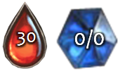 |
| Each player starts with a deck of 20 _Damage_ cards with the following Mana costs: 0,0,1,1,2,2,2,3,3,3,3,4,4,4,5,5,6,6,7,8 | 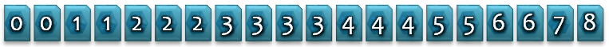 |
| From the deck each player receives 3 random cards has his initial hand. | 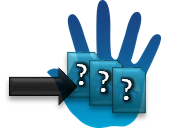 |
| One player is randomly chosen to be the starting _active player_. The _other_ player draws a 4th card from his deck to compensate him for not playing the first turn. | 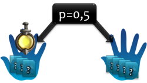 |

### <a name="BasicGameplay"/> Basic Gameplay

| Step | Rule | |
| --- | --- | --- |
| 1. | The active player receives 1 Mana slot up to a maximum of 10 total slots. | 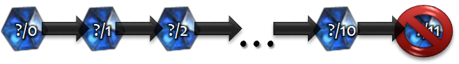 |
| 2. | The active player's empty Mana slots are refilled. |  |
| 3. | The active player draws a random card from his deck. |  |
| 4. | The active player can play as many cards as he can afford. Any played card empties Mana slots and deals immediate damage  to the opponent player equal to its Mana cost. | 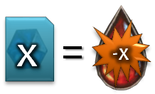 |
| 5. | If the opponent player's Health drops to or below zero the active player wins the game. | 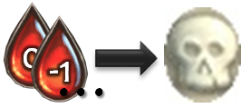 |                                                                                     
| 6. | If the active player can't (by either having no cards left in his hand or lacking sufficient Mana to pay for any hand card) or simply doesn't want to play another card, the opponent player becomes active. | |

### Special Rules

| Rule | Description | |
| --- | --- | --- |
| _Bleeding Out_ | If a player's card deck is empty before the game is over he receives 1 damage instead of drawing a card when it's his turn. | 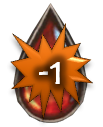 |
| _Overload_ | If a player draws a card that lets his hand size become >5 that card is discarded instead of being put into his hand. | 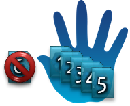 |              
| _Dud Card_ | The 0 Mana cards can be played for free but don't do any damage either. They are just annoyingly taking up space in your hand. |  |

## <a name="AdvancedVariations"/> Advanced Variations

When the normal game rules have become too easy/boring you might consider adding some additional rules like those described below. Some of them will increase the complexity of the game significantly, so you might not want to use all extra rules at once:

### Healing

| Rule | |
| --- | --- |
| When playing a card the active player can choose to use it for causing damage (see [Basic Gameplay](#BasicGameplay)) or for _healing himself_ by a value equal to the mana cost amount. | 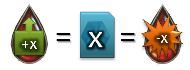 |
| Players cannot heal up above 30 health. | 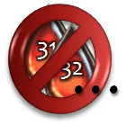 |

### Minions

| Rule | |
| --- | --- |
| Let players choose to play cards either as immediate damage _Attacks_ (same as cards generally worked in the [Basic Gameplay](#BasicGameplay) rules) or as _Minions_ that are put on the board instead. Minions will use the mana cost of their card as Health and Damage value. Playing a 0 card will create a minion with 1 Health and 0 Damage. | 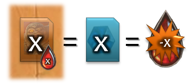 |
| Health has to be tracked when they receive damage. ||
| Each player can have a _maximum of 3 Minions_ on the board at any given time. | | 
| A Minion will _sleep_ in the turn it was put on the board. | 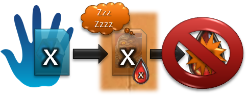 |
| In any subsequent turn _each_ Minion can be used _once_ to deal damage to the opponent player or an opponent Minion. | 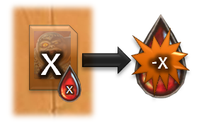 |
| A Minion fighting another Minion will result in them dealing their damage value to each other simultaneously. | 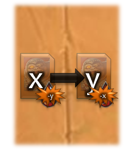 |
| Sleeping Minions will defend themselves in the same way when attacked by another Minion. | 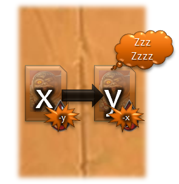 |
| Players can choose to play an Attack against a Minion. The attacked Minion will not defend itself in this case, thus the attacking player receives no damage from it. | 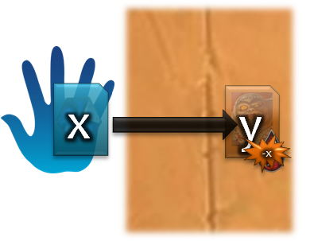 |
| When a Minions health drops to or below zero it is removed from the board. | 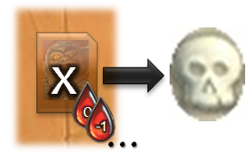 | 

### Miscellaneous

- Let Mana cost and damage dealt be different from each other thus making cheap powerful, expensive mediocre or entirely useless cards possible. This can add a whole new layer of play strategy as some cards might not be desired to be ever played, but eventually have to in order to free your hand for better cards.
- Introduce _Card Drawer_ cards that cost Mana but don't do any damage. Instead they let you draw a given number of cards from your deck. Those cards can be used in the current turn or later on (just as if normally drawn at the beginning of the active player's turn).
- Allow players to create their own decks of 20 cards from a larger _Card Pool_. Let those decks be saved to and loaded from disk before starting a game.

## Static Code Analysis

### Java  

### Javascript   

### Groovy 

### Clojure 
